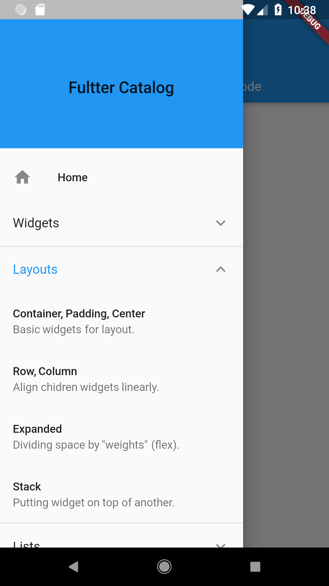
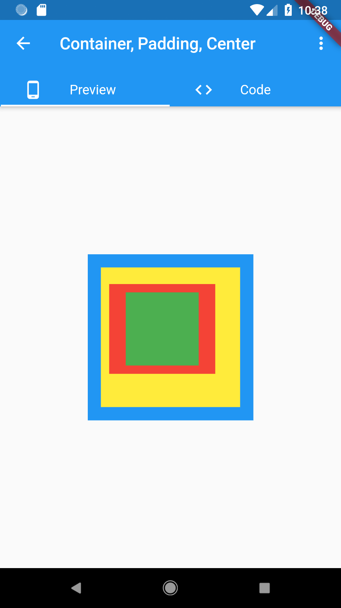
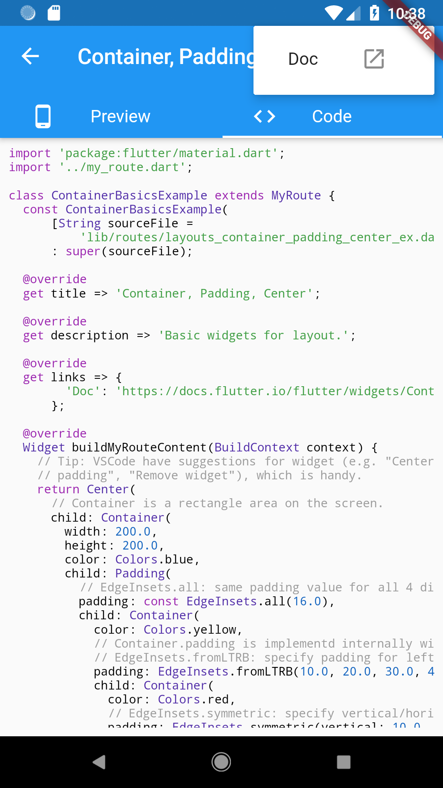

# Flutter Catalog

An app showcasing Flutter components, with side-by-side source code view.

## Screenshots

## Adding a new example page

1. Create a dart file under `lib/route/` (or just duplicate a file, e.g. `cp widgets_icon_ex.dart new_example.dart`);
2. In the new file, create a class that extends MyRoute;
3. Add const constructor, the convention is to use the file path as constructor's default parameter;
4. (Optional) override getters: `title`, `description`, `links`;
5. Override `buildMyRouteContent()`, try to make the code simple, as it'll be shown on phone screens;
6. Open `lib/my_app_meta.dart`, import the new file at the beginning of file;
7. In `kMyAppRoutesStructure`, add an instantiation of the new class under the appropriate item group.

## Credits

This app is written with reference to many resources, including:

* Offical gallery app: https://github.com/flutter/flutter/tree/master/examples/flutter_gallery
* Andrea Bizzotto's YouTube channel: https://www.youtube.com/channel/UCrTnsT4OYZ53l0QGKqLeD5Q
* Tensor Programming's YouTube channel: https://www.youtube.com/watch?v=WwhyaqNtNQY&list=PLJbE2Yu2zumDqr_-hqpAN0nIr6m14TAsd
* Eajy's flutter demo: https://github.com/Eajy/flutter_demo