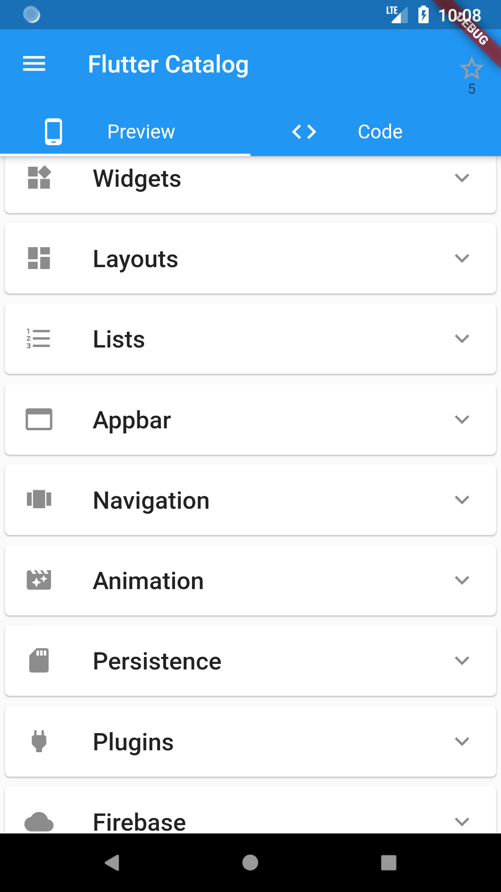
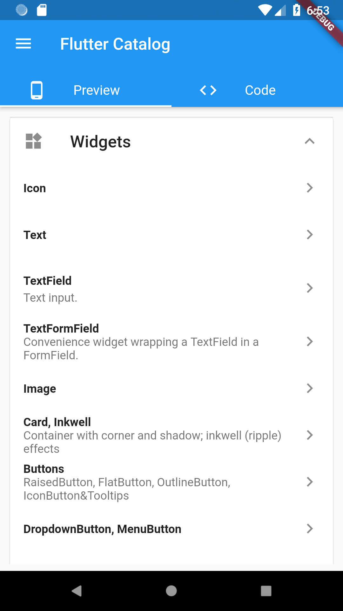
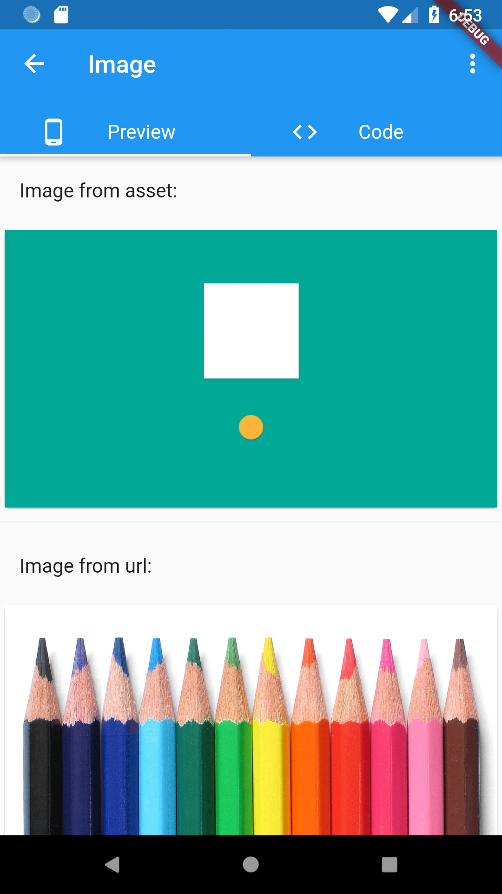
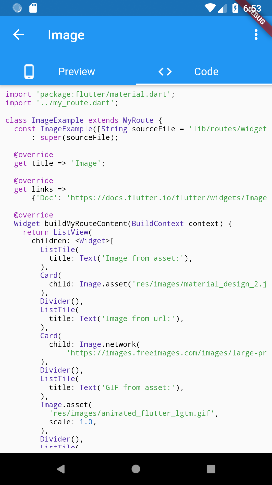
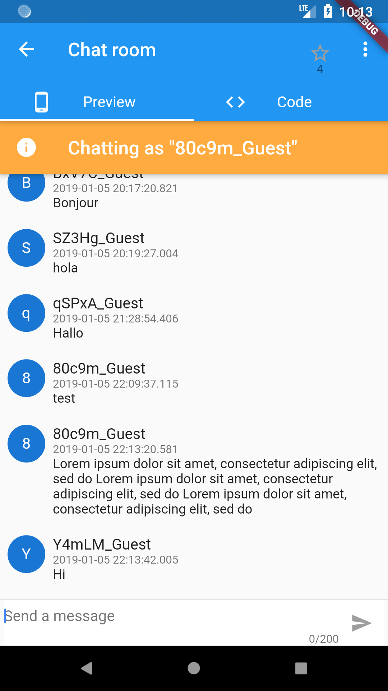
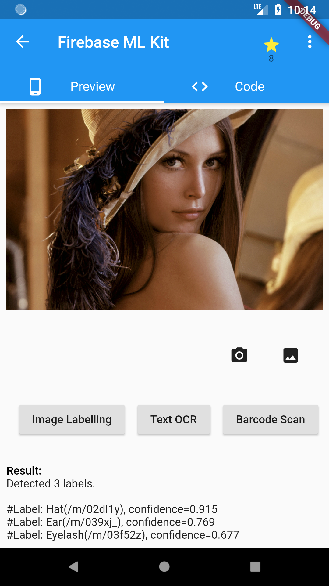

# Flutter Catalog 

An app showcasing Flutter components, with side-by-side source code view.

**🚀🚀 New: Flutter Catalog is now available in the browser! Check it out [here](https://x-wei.github.io/flutter_catalog/).**
And note there are some [limitations](https://github.com/X-Wei/flutter_catalog/issues/31#issuecomment-615964713) to the web variant.

## Screenshots

## Credits

This app is written with reference to many resources, including:

* Offical gallery app: https://github.com/flutter/gallery
* Andrea Bizzotto's YouTube channel: https://www.youtube.com/channel/UCrTnsT4OYZ53l0QGKqLeD5Q
* Tensor Programming's YouTube channel: https://www.youtube.com/watch?v=WwhyaqNtNQY&list=PLJbE2Yu2zumDqr_-hqpAN0nIr6m14TAsd
* Eajy's flutter demo: https://github.com/Eajy/flutter_demo
